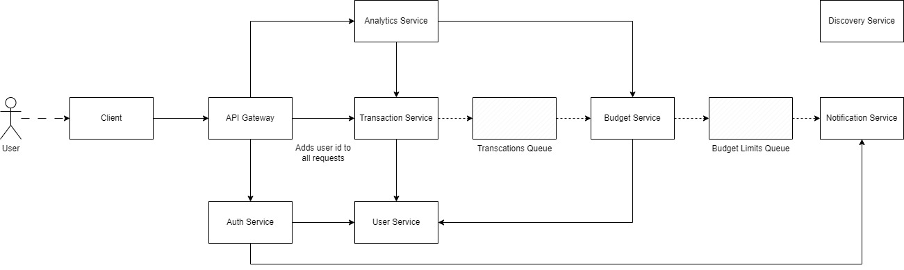

# Finance-App

### Table of contents

- [Technologies](#technological-stack)
- [Requirements](#requirements)
- Microservice Architecture
  - [Services description](#microsevice-arhitecture)
  - [Services relationship scheme](#services-relationship)
- [Database](#database-models)
- [API](#api)
- [Frontend pages](#frontend-pages)

---

### Technological stack

 - Frontend :
    - React , Redux-Toolkit 
    - NextJs , Next-Intl , Next-Themes
    - Tailwind 

- Backend : 
    - Spring-Boot
    - Spring Cloud (Eureka)
    - Spring Security + JWT 
    - Spring Data JPA + PostgreSQL
    - Redis
    - Docker
    - Docker Compose
    - Kafka

- Mobile : 
    - Capacitor / React-Native(WebWiew)

### Requirements

- Backend
    1. Microservice arhitecture (Optional)

- Mobile
    1. User authentication and secure login.
    2. OAuth
    3. Add, edit, and delete transactions (income & expenses).
    4. Generate monthly expense reports with charts.
    5. Set budget limits and receive alerts when exceeding limits.
    6. Categorization of transactions (food, transport, rent, etc.).
    7. Cloud backup and synchronization across multiple devices.
    8. Export reports to CSV or PDF.

- Frontend
    1. Well

### Microsevice Arhitecture

>_Income service request_  <-( _service_ ) \
>_Outcome service request_  ( _service_ ) -> 

>_Income service message_ <<<✉ _service_  
>_Outcome service message_ ✉>>> _service_  

- User Service
    1. Create User  <-( Auth-Service )
    2. Update User <-( Auth-Service ) 
    3. Get User
    
- Auth Service 
    1. Register user ->(User Service)
    2. Login User
    3. Verify token
    4. Password Change Req -> (Notification Service)
    5. Password Change -> (User Service)

- Transaction Service
    1. Create Transaction ✉>>> Budget-Service
    2. Update Transaction ✉>>> Budget-Service
    3. Delete Transaction ✉>>> Budget-Service
    4. Get One Transaction
    5. Get All Transactions (Pagination)

- Constraints Service
    1. Get Constraint 
    2. Create Constraint
    3. Update Constraint 
    4. Delete Constraint
    5. Update Constrain-Limit 

       <<<✉ Transaction-Service  
      - >>>✉ Notification-Service

- Notification Service 
    1. Send Email Notification for password change <-(Auth Service)
    2. Send Email Notification about budget limit <<<✉ Transaction-Service  
    3. Send Push Notification for budget limit <<<✉ Transaction-Service 
    4. Send WebSocket Notification  <<<✉ Transaction-Service 
    

- Financial Analitics Servise
    1. Create raw report (CSV) <- ( Transaction-Service )
    2. Create diagrams report (PDV) <- ( Transaction-Service )
        - all income
        - all outcome
        - categories outcome
        - timeline income/outcome
        - ...
    3.Get analitics data for diagrams. (...)

- Statistic servise
    1.Get budget
    2.Get day , month , year , alltime - income/outcome
    3.Get day , month , year , alltime for category

### Services Relationship




### Database Models

    User :
        - id 
        - email
        - password 

    Transaction :
        - id
        - title
        - type ('income' | 'outcome')
        - value
        - time
        - category

    Constraint : 
        - id
        - value  
        - available (value - moment_outcome)
        - time

    Category :
        - id
        - title
        - day_income
        - day_outcome
        - month_income
        - month_outcome
        - year_income
        - year_outcome

    Budget :
        - id
        - budget_value (available money)
        - day_income
        - day_outcome
        - month_income
        - month_outcome
        - year_income
        - year_outcome

### API 

 
- User Service
    1. Create User
        > POST /api/users
    2. Update User  
        > PUT /api/users/:id
    3. Get User
        > GET /api/users/:id
    
- Auth Service 
    1. Register user 
        > POST /api/auth/registration
    2. Login User
        > POST /api/auth/login
    4. Password Change Req
        > POST /api/auth/password_change_req
    5. Password Change
        > POST /api/auth/password_change
    6. Logout User  
        > POST /api/auth/logout
    7. Refresh Token  
        > POST /api/auth/refresh


- Transaction Service
    1. Create Transaction 
        > POST /api/transactions
    2. Update Transaction 
        > PUT /api/transactions/:id
    3. Delete Transaction 
        > DELETE /api/transactions/:id
    4. Get One Transaction
        > GET /api/transactions/:id
    5. Get All Transactions (Pagination)
        > GET /api/transactions?page=x&size=x

- Statistic servise
    1. Get budget
        > GET ///
    2. Get all statistic (day , month , year , alltime) , income / outcome
    3. Get category statistic

- Constraints Service
    1. Get Constraint 
        > GET /api/constraints/:userid
    2. Create Constraint
        > POST /api/constraints
    3. Update Constraint 
        > PUT /api/constraints/:userid
    4. Delete Constraint
        > DELETE /api/constraints/:userid
    5. Update Constrain-Limit
        > PUT /api/constraints/limit/:userid 

- Notification Service 
    1. Send Email Notification for password change 
        > POST /api/notifications/email/password-change
    2. Send Email Notification about budget limit 
        > POST /api/notifications/email/budget-limit  
    3. Send Push Notification for budget limit 
        > POST /api/notifications/email/budget-limit  
     4. Send WebSocket Notification  
        > WS /api/notifications/ws

- Financial Analitics Servise
    1. Create raw report (CSV)
        > GET /api/analytics/csv
    2. Create diagrams report (PDF)
        > GET /api/analytics/pdf

### Frontend Pages

- Layout
    - Header
        - Navigation
            - Analitics
            - Home 
        - Button-Bar
            - Change-Locale-Button
            - Change-Theme-Button
            - Logout-Button

- Modal Windows
    - Create Transaction
    - Update Transaction
    - Delete Suggestion
    - Create Constraint
    - Change Constraint

- Verification Page
    - Login Page
        - Login Form
    - Registration Page
        - Registration Form
    - Restore Password Req
        - Email Form
    - Restore Password
        - Restore Password Form

- Home Page
    - Section
        - Current Budget Brick
        - Constraint-Block
            - Constraint Brick
            - Add-Constraints-Button
        - Categories Bricks
    - Aside
        - Transaction History
        - Add-Transaction-Button

- Analitics Page
    - Section
        - all income Brick
        - all outcome Brick
        - all income Circle-Diagram
        - all outcome  Circle-Diagram
        - Categories Outcome Bricks
        - timeline income/outcome Time-Graph
    - Aside
        - Raw Data Container 
        - Generate-CSV-Button


```

├── app
|  ├── favicon.ico
|  ├── globals.css
|  ├── layout.tsx
|  ├── [locale]
|  |  ├── layout.tsx
|  |  ├── page.tsx
|  |  └── verification
|  |     ├── layout.tsx
|  |     ├── login
|  |     |  └── page.tsx
|  |     ├── registration
|  |     |  └── page.tsx
|  |     ├── restore_password
|  |     |  └── page.tsx
|  |     └── restore_password_req
|  |        └── page.tsx
|  └── _components
|     ├── common
|     |  ├── Button.tsx
|     |  ├── ContsraintValue.tsx
|     |  ├── DeleteButton.tsx
|     |  ├── DropdownMenu.tsx
|     |  ├── Loading.tsx
|     |  ├── MoneyValue.tsx
|     |  └── TextInput.tsx
|     ├── layout
|     |  ├── Header
|     |  |  ├── AppTitle.tsx
|     |  |  ├── Button-Bar
|     |  |  |  ├── ButtonBar.tsx
|     |  |  |  └── buttons
|     |  |  |     ├── LocaleButton.tsx
|     |  |  |     ├── LogoutButton.tsx
|     |  |  |     └── ThemeButton.tsx
|     |  |  ├── Header.tsx
|     |  |  └── Navigation
|     |  |     ├── links
|     |  |     |  ├── AnaliticsLink.tsx
|     |  |     |  └── HomeLink.tsx
|     |  |     └── Navigation.tsx
|     |  ├── Modal
|     |  |  ├── Modal.tsx
|     |  |  ├── ModalLayout.tsx
|     |  |  └── modals
|     |  |     ├── CategoryOverview
|     |  |     |  ├── buttons
|     |  |     |  |  ├── ChangeCategoryButton.tsx
|     |  |     |  |  └── DeleteCategoryButton.tsx
|     |  |     |  └── CategoryOverview.tsx
|     |  |     ├── ChangeConstraintForm.tsx
|     |  |     ├── ChangeTransactionForm.tsx
|     |  |     ├── CreateCategoryForm.tsx
|     |  |     ├── CreateConstraintForm.tsx
|     |  |     ├── CreateTransantionForm.tsx
|     |  |     ├── DeleteSuggestion.tsx
|     |  |     ├── ExitSuggestion.tsx
|     |  |     └── TransactionOverview
|     |  |        ├── buttons
|     |  |        |  ├── ChangeTransactionButton.tsx
|     |  |        |  └── DeleteTransactionButton.tsx
|     |  |        └── TransactionOverview.tsx
|     |  └── VerificationWrapper
|     |     └── VerificationWrapper.tsx
|     └── pages
|        ├── analitics
|        |  ├── aside
|        |  |  ├── GenerateCSVButton.tsx
|        |  |  └── RawDataContainer.tsx
|        |  └── section
|        |     ├── CategoriesStatistic
|        |     |  └── StatisticCategory.tsx
|        |     ├── CircleDiagrams
|        |     |  └── CircleDiagram.tsx
|        |     ├── StatisticBricks
|        |     |  └── StatisticBrick.tsx
|        |     └── TimeGraph
|        |        └── TimeGraph.tsx
|        └── home
|           ├── aside
|           |  ├── AddTransactionButton
|           |  |  └── AddTransactionButton.tsx
|           |  ├── ContentAside.tsx
|           |  └── TransactionHistory
|           |     ├── TransactionContainer
|           |     |  ├── Transaction.tsx
|           |     |  └── TransactionContainer.tsx
|           |     └── TransactionHistory.tsx
|           ├── ContentPage.tsx
|           ├── section
|           |  ├── Budget
|           |  |  ├── Budget.tsx
|           |  |  └── Statistic
|           |  |     └── PeriodStatistic.tsx
|           |  ├── Category
|           |  |  ├── Categories.tsx
|           |  |  ├── CategoryBrick.tsx
|           |  |  └── CreateCategoryButton.tsx
|           |  ├── Constraint
|           |  |  ├── AddConstraintButton.tsx
|           |  |  └── Constraint.tsx
|           |  └── ContentSection.tsx
|           └── UnloginedPage.tsx
├── enums.ts
├── i18n
|  ├── request.ts
|  └── routing.ts
├── middleware.ts
├── store
|  ├── ReduxProvider.tsx
|  ├── slices
|  |  ├── dragSlice.ts
|  |  ├── modalSlice.ts
|  |  ├── taskBoardsSlice.ts
|  |  └── userSlice.ts
|  └── store.ts
└── utils
   ├── calculator.ts
   ├── fetchApi.ts
   ├── hooks
   |  ├── useLogin.ts
   |  └── useModal.ts
   ├── jwt.ts
   └── ThemesProvider.tsx

```        


